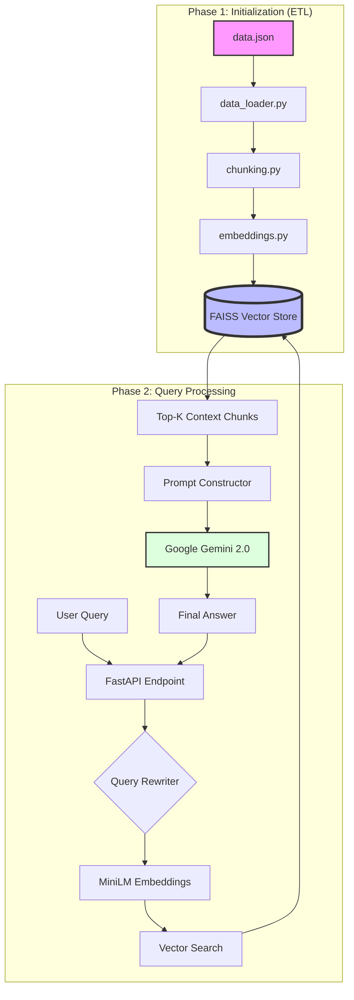
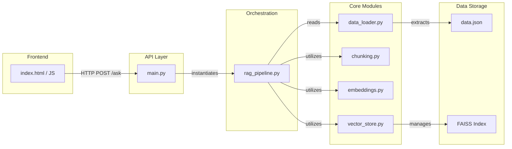

# 🤖 E-commerce RAG System (AirDoctor & AquaTru)

A production-grade Retrieval-Augmented Generation (RAG) system built to serve as an intelligent product assistant for AirDoctor (air purifiers) and AquaTru (water purifiers). This project combines a modern frontend with a highly optimized vector-search backend.

---

## 🗺️ System Architecture

### 1. High-Level Architecture Flow
This diagram illustrates the "Life of a Query," showing how data is ingested and how user queries are processed through the RAG pipeline.



### 2. Codebase & File Linkage
This diagram shows the internal dependencies and how the various Python modules interact.



---

## 🏗️ Tech Stack & Architecture

*   **Backend Framework**: `FastAPI` (High performance, async support)
*   **Vector Database**: `FAISS` (Facebook AI Similarity Search - optimized for dense vector retrieval)
*   **Embeddings**: `sentence-transformers` (`all-MiniLM-L6-v2`) for fast, local, high-quality semantic embeddings.
*   **LLM Provider**: `Google Gemini 2.0 Flash` via the `google-genai` SDK.
*   **Frontend**: Vanilla HTML/CSS/JS with a Glassmorphism design and real-time streaming-style updates.

---

## ⚙️ System Flow: How It Works

### 1. Initialization Phase (On Server Startup)
When `main.py` is executed, the `RAGPipeline` initializes:
1.  **Data Loading**: Reads `data.json` and flattens structured JSON objects (specs, FAQs, descriptions) into dense, highly contextual text strings.
2.  **Chunking**: Splits the flattened strings into smaller semantic chunks (400 characters with a 50-character overlap) using `chunking.py`. Overlap ensures context isn't lost at the boundaries.
3.  **Embedding**: Passes chunks through the local `MiniLM-L6-v2` transformer model to generate dense vector embeddings (384 dimensions).
4.  **Indexing**: Loads the vectors into a `faiss.IndexFlatL2` index for blazing-fast L2 distance (Euclidean) similarity search. Metadata (product names) is stored in a parallel Python list.

### 2. Query Phase (On User Request)
1.  **Frontend Request**: User types a question in the UI. JS sends a `POST` request to the FastAPI `/ask` endpoint, including both the new query and the **Chat History** (last 3 turns).
2.  **Query Rewriting**: If history is present, the pipeline first asks the LLM to rewrite the query so pronouns (like "Does it have wheels?") are resolved into standalone questions (like "Does the AirDoctor 4000 have wheels?").
3.  **Cache Check**: The system checks an in-memory dictionary cache. If the exact standalone query with the same history length was asked recently, it returns the cached response instantly.
4.  **Vector Search**: The standalone query is embedded using the `MiniLM` model. The vector is compared against the FAISS index to find the `top_k=3` most semantically similar chunks.
5.  **Prompt Construction**: The retrieved chunks and the **Chat History** are formatted into a rigid prompt template. The system prompt bounds the LLM to base factual answers ONLY on the provided context.
6.  **Generation**: Gemini 2.0 Flash processes the prompt. If the answer isn't in the context, it outputs "I don't know" to prevent hallucination.
7.  **Response**: The generated text and the source product names are returned to the UI, and the UI updates its internal chat history array.

---

## 📂 Detailed File Explanations & Pseudo Code

### `data.json`
The system's Knowledge Base. Contains structured data for all AirDoctor (including "i", "M", and "H" smart/commercial variants) and AquaTru models. Storing data cleanly here makes it incredibly easy to scale or update the product line.

### `chunking.py`
Contains the `split_text` logic. We use fixed-size chunking (400 chars) with a 50-char overlap. This prevents a sentence from being cut in half and losing its context, ensuring high retrieval quality.

**Pseudo Code:**
```python
def split_text(text, chunk_size, overlap):
    if text is empty: return empty list
    initialize chunks list and start index to 0
    while start index < length of text:
        extract substring from start to start + chunk_size
        append substring to chunks list
        increment start index by (chunk_size - overlap)
    return chunks list
```

### `data_loader.py`
The ETL (Extract, Transform, Load) script. It reads the raw JSON and converts it into a format optimized for embeddings. By flattening specs and FAQs into plain English strings, it ensures the embedding model captures the actual semantic meaning of the technical data.

**Pseudo Code:**
```python
def load_products(file_path):
    read and parse JSON file at file_path
    return parsed data as list of dictionaries

def prepare_chunks(products):
    initialize empty list all_chunks
    for each product in products:
        format product details (name, category, description, specs, faqs) into a single string
        call split_text to break the formatted string into text_chunks
        for each text_chunk:
            create dictionary with text_chunk and product metadata
            append dictionary to all_chunks
    return all_chunks
```

### `embeddings.py`
Wraps the HuggingFace `SentenceTransformer` library. We use `all-MiniLM-L6-v2` because it strikes the perfect balance between speed (it runs instantly on a CPU) and semantic accuracy.

**Pseudo Code:**
```python
class EmbeddingModel:
    def __init__(model_name):
        load the pre-trained SentenceTransformer model
        
    def get_embeddings(texts):
        encode the list of texts into vector embeddings using the model
        return embeddings as float32 numpy array
        
    def get_query_embedding(query):
        encode the single query string into a vector embedding
        return embedding as float32 numpy array
```

### `extract_pdfs.py`
Script to extract product information from PDF manuals using Google Gemini API and update the `data.json` knowledge base.

**Pseudo Code:**
```python
def extract_text_from_pdf(pdf_path):
    read PDF file
    for first 20 pages:
        extract text and append to result string
    return result string

def process_pdf_with_gemini(text, pdf_name):
    create prompt instructing Gemini to extract product data as JSON
    call Gemini API with prompt and extracted text
    clean up markdown formatting from response
    return parsed JSON object

def main():
    load existing data.json
    for each PDF in pdf directory:
        extract text using extract_text_from_pdf
        extract structured data using process_pdf_with_gemini
        if product already exists in data.json:
            update existing product specs and add new FAQs
        else:
            append new product data
    save updated data back to data.json
```

### `list_models.py`
Utility script to list available models in the Gemini API.

**Pseudo Code:**
```python
def list_models():
    initialize Gemini client with API key
    fetch list of available models from client
    for each model:
        print model name and supported actions
```

### `main.py`
The FastAPI application. It mounts the `static/` directory to serve the frontend UI and exposes the `/ask` REST endpoint. The pipeline is instantiated *once* globally to prevent reloading models on every request.

**Pseudo Code:**
```python
initialize FastAPI application
initialize RAGPipeline globally with data.json

define ChatRequest schema (query, history)

@GET "/"
def read_root():
    serve index.html from static directory

@POST "/ask"
def ask_question(request):
    log incoming request
    call pipeline.ask with user query and chat history
    return generated response and sources
```

### `rag_pipeline.py`
The core orchestration engine. It initializes the embedding model and vector store, manages the query-to-retrieval pipeline, implements the in-memory cache, and makes the API calls to Google Gemini using strict prompt engineering to prevent hallucinations.

**Pseudo Code:**
```python
class RAGPipeline:
    def __init__(data_path):
        initialize EmbeddingModel
        load products and prepare chunks
        initialize VectorStore with embedding dimension
        generate embeddings for all chunks
        add embeddings and chunk data to VectorStore
        initialize in-memory cache
        
    def get_llm_response(context, query, history):
        format prompt with system instructions, chat history, context, and query
        if Gemini API is available:
            try to call Gemini 2.0 Flash
            if rate limited, fallback to Gemini 1.5 Flash
            return generated answer
        else:
            return mock response
            
    def rewrite_query(query, history):
        if history exists:
            prompt Gemini to rewrite the query as a standalone question
            return rewritten query
        return original query
        
    def ask(query, history):
        rewrite query to resolve pronouns based on history
        generate cache key
        if cache hit: return cached result
        
        generate embedding for the standalone query
        search VectorStore for top 3 matching chunks
        combine matching chunks into context string
        extract source product names
        
        call get_llm_response with context, original query, and history
        store answer and sources in result dictionary
        save result to cache
        return result
```

### `test_cli.py`
A CLI tool to quickly test the RAG pipeline without running the API server.

**Pseudo Code:**
```python
def main():
    initialize RAGPipeline with data.json
    define list of test queries
    for each query:
        call pipeline.ask(query)
        print assistant answer and sources
```

### `vector_store.py`
Wraps the `FAISS` library. `IndexFlatL2` is used to perform exact nearest-neighbor search. While `FlatL2` scales linearly, for our dataset size, it is microsecond-fast and requires no complex training (unlike IVF/PQ indexes).

**Pseudo Code:**
```python
class VectorStore:
    def __init__(dimension):
        initialize FAISS IndexFlatL2 with given dimension
        initialize empty metadata list
        
    def add_chunks(embeddings, chunks):
        add embeddings to FAISS index
        append chunk dictionaries to metadata list
        
    def search(query_embedding, top_k):
        search FAISS index for top_k closest vectors to query_embedding
        get distances and indices of results
        for each valid index:
            retrieve corresponding chunk from metadata list
        return list of matched chunks
```

### `static/index.html`
The frontend SPA. Uses pure vanilla JS/CSS to avoid heavy framework dependencies. Features a modern dark theme, CSS animations for loading states, and dynamic DOM manipulation to render chat messages and source tags.

---

## 🚀 Setup & Execution

1. **Install Dependencies:**
   ```bash
   pip install -r rag_app/requirements.txt
   ```
2. **Set API Key (Windows PowerShell):**
   ```powershell
   $env:GEMINI_API_KEY="your_api_key_here"
   ```
3. **Run Server:**
   ```bash
   python rag_app/main.py
   ```
4. **Access UI:** Open `http://localhost:8000` in your browser.

---

## 💡 Interview Talking Points (Why I built it this way)

*   **Why FAISS instead of a managed DB like Pinecone?**
    *"For a focused product catalog, a managed vector DB introduces unnecessary network latency and cost. FAISS runs entirely in-memory, providing microsecond retrieval times which keeps our latency incredibly low."*
*   **Why local MiniLM embeddings?**
    *"By running `all-MiniLM-L6-v2` locally, we avoid the API cost and latency of hitting OpenAI/Google for embeddings. It’s lightweight enough to run on a CPU while still capturing deep semantic meaning."*
*   **How do you prevent hallucinations?**
    *"I implemented strict Prompt Engineering in `rag_pipeline.py`. The LLM is instructed to answer ONLY from the provided context chunks. If the similarity search pulls irrelevant chunks, the LLM is instructed to say 'I don't know'."*
*   **How did you handle the UI?**
    *"I built a lightweight Vanilla JS SPA served directly by FastAPI. This avoids the overhead of Next.js/React for a simple chat interface, while still delivering a premium, responsive user experience."*
